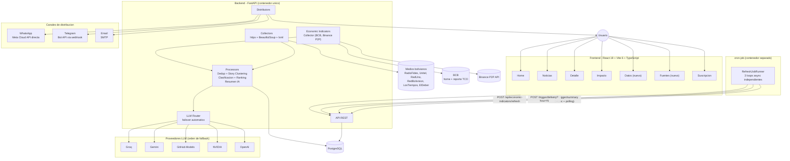
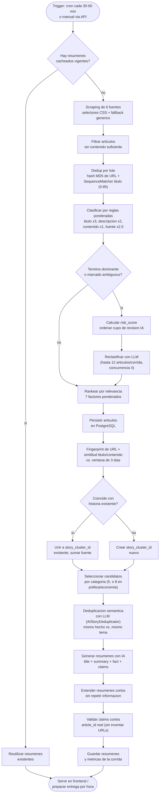

# Capítulo 3 — Solución Propuesta

## 3.1 EcoBrief Bolivia

EcoBrief Bolivia actúa como una capa de eficiencia entre las fuentes de noticias y las personas. Es una plataforma tecnológica que automatiza el proceso de recolección, filtrado, agrupación, priorización y síntesis de noticias locales, con especial énfasis en que cada resumen pueda trazarse hasta su fuente original.

### Comparativa antes vs. después

| Antes | Con EcoBrief |
|---|---|
| Abrir varios sitios de noticias | Ver un resumen centralizado |
| Leer titulares repetidos entre medios | Ver una sola historia agrupada, con la cantidad de fuentes que la cubrieron |
| Hacer *scroll* en redes para informarse | Consumir información sintetizada y trazable |
| Ver contenido viral sin contexto | Acceder a fuentes identificadas, enlaces originales y evidencia por afirmación |
| Consumir páginas completas | Consumir resúmenes compactos |
| Procesar todo con IA | Usar IA solo después de filtrar, deduplicar y agrupar |
| Depender de un solo proveedor de IA | Conmutar automáticamente entre 5 proveedores si uno falla |
| No saber cuánto se reduce | Ver métricas de impacto de corridas reales |
| Recibir información no personalizada | Elegir categorías, canal y hora de entrega |

## 3.2 Arquitectura del sistema

El sistema está construido como cuatro servicios independientes orquestados con Docker Compose: **postgres**, **backend**, **frontend** y **cron-job**. A diferencia de la versión anterior, el programador de tareas (*scheduler*) ya no vive dentro del backend: es un contenedor Python separado, con su propio código, dependencias y configuración, que dispara el trabajo del backend por HTTP.

### Frontend

Aplicación web desarrollada con **React 19**, **Vite 6** y **TypeScript 5.7**, con un router propio (sin `react-router`). Vistas actuales:

- **Home:** Noticias destacadas, resumen visual e indicadores de impacto.
- **Noticias:** Listado completo de artículos y resúmenes.
- **Detalle:** Artículo original, fuente, resumen IA, claims con evidencia y artículos relacionados de la misma historia.
- **Impacto:** Panel de métricas Green Tech.
- **Datos** *(nuevo):* Indicadores económicos (dólar oficial BCB, Binance P2P) y clima.
- **Fuentes** *(nuevo):* Listado de medios monitoreados.
- **Suscripción:** Preferencias de categoría, canal de entrega y hora preferida.

### Backend API

El backend es el corazón de EcoBrief. Construido con **FastAPI** sobre Python asíncrono, corre en un único contenedor con `gunicorn` y 4 *workers* `uvicorn`. Expone una API REST agrupada en:

- **Noticias y resúmenes:** `/api/articles`, `/api/articles/{id}`, `/api/articles/{id}/related`, `/api/summaries`, `/api/news/category-counts`, `/api/stories/{id}`, `/api/sources`.
- **Suscripción:** `/api/preferences/options`, `/subscribe`, `/unsubscribe`, `/preview`.
- **Indicadores económicos:** `/api/economic-indicators`, `/api/economic-indicators/refresh`.
- **Triggers de cron:** `POST /trigger/summary` (con `GET /trigger/summary/jobs/{job_id}` para sondear el resultado), `POST /trigger/delivery`.
- **Métricas de impacto:** `/api/impact-metrics`.
- **Salud del sistema:** `/`, `/health`, `/stats`.
- **Webhooks de canales:** `/webhook/whatsapp`, `/webhook/telegram`.

Un cambio operativo importante desde la v1: la generación de resúmenes (`POST /trigger/summary`) dejó de ser una llamada bloqueante. Ahora devuelve un `job_id` y una `status_url` de inmediato, y el proceso corre en segundo plano mientras el cron-job sondea su estado cada 15 segundos (hasta 30 minutos). Este cambio fue motivado por corridas reales que llegaron a tardar **573 segundos**, superando los tiempos de espera fijos que el diseño anterior asumía.

## 3.3 El servicio cron-job

`cron-job/` es un paquete Python independiente (propio `Dockerfile`, `requirements.txt` y configuración), que corre tres bucles asíncronos disparando peticiones HTTP al backend:

| Job | Endpoint | Cadencia por defecto |
|---|---|---|
| Refresco de indicadores económicos | `POST /api/economic-indicators/refresh` | cada 30 minutos (configurable; en este entorno, 10 min) |
| Refresco de resúmenes | `POST /trigger/summary` (asíncrono + sondeo) | horas fijas: 8, 10, 13, 16, 19, 22 (America/La_Paz) |
| Entrega a suscriptores | `POST /trigger/delivery?hour=N` | cada hora entre las 9 y las 23 |

Separar este componente del backend permite reiniciar o depurar el programador sin afectar la API que sirve al frontend, y viceversa.

## 3.4 Pipeline de procesamiento

### 3.4.1 Web Scraping

El sistema utiliza `httpx` junto con `BeautifulSoup` y `lxml` para realizar *web scraping*. Cada fuente está definida en `config/sources.yaml` con selectores CSS configurables. **Hoy hay 6 fuentes activas**: Radio Fides, Unitel, Red Uno, Red Bolivisión, Los Tiempos y El Deber — dos fuentes que estaban en la versión anterior (Página Siete y ATB) ya no forman parte de la configuración activa. Cuando una fuente cambia su estructura HTML, el sistema conserva el mecanismo de *fallback* genérico que extrae todos los enlaces del documento y filtra aquellos que parecen artículos periodísticos.

### 3.4.2 Deduplicación multinivel

La versión anterior describía tres niveles fijos de deduplicación. En la práctica, hoy son **cuatro capas independientes**, cada una resolviendo un problema distinto:

1. **Deduplicación por lote (en memoria, por corrida):** hash MD5 de cada URL para descartar enlaces exactos repetidos, y comparación de títulos normalizados con `SequenceMatcher` (umbral 0.85) para detectar reediciones del mismo titular dentro de la misma corrida.
2. **Huella de contenido histórica:** normalización de la URL (elimina parámetros de tracking como `utm_*`, `fbclid`, `gclid`, ordena los parámetros restantes) y un `content_fingerprint` SHA-256 basado en categoría + título normalizado + fragmento de contenido, para reconocer el mismo artículo entre corridas distintas.
3. **Agrupación de historias (*story clustering*) por similitud y ventana temporal:** `story_similarity()` combina similitud de título (peso 0.65) y similitud Jaccard de tokens de título+extracto (peso 0.35). Si el resultado supera **0.85**, ajustado por un factor de proximidad temporal dentro de una ventana de **3 días**, el nuevo artículo se une al `story_cluster_id` existente en lugar de crear una historia nueva. Cada historia (`stories`) acumula cuántos artículos y cuántas fuentes distintas la cubrieron.
4. **Deduplicación semántica con IA (opcional):** un componente dedicado (`AIStoryDeduplicator`) usa un LLM para detectar duplicados que la heurística no puede capturar — mismos hechos contados con palabras muy distintas — aplicando una distinción explícita entre "es la misma noticia" y "es el mismo tema, pero es una noticia distinta", tanto contra otros candidatos del lote como contra resúmenes ya publicados el mismo día.

Los duplicados no se eliminan definitivamente: se marcan para auditoría y se excluyen de los candidatos a resumen, preservando la trazabilidad — el mismo principio de la versión anterior, ahora aplicado en más capas.

### 3.4.3 Agrupación de historias y evidencia

Cuando varios artículos de distintas fuentes se unen al mismo `story_cluster_id`, el sistema no solo cuenta cuántas fuentes cubrieron la historia: arma un resumen de cobertura que clasifica cada afirmación según su respaldo —confirmada por múltiples fuentes, basada en una declaración oficial, o reportada por una sola fuente— y lo adjunta al resumen final como `source_article_count` y `claims`. Cada *claim* generado por el LLM debe apuntar a un `article_id` real con un fragmento de evidencia (`excerpt`); el sistema descarta explícitamente cualquier afirmación cuya evidencia no pueda verificarse contra un artículo existente, en vez de confiar en lo que el modelo "recuerda".

La detección de **contradicciones** entre fuentes (p. ej. una fuente dice 3 heridos, otra dice 5) fue evaluada y queda **deliberadamente sin implementar**, documentada en el código como limitación conocida por falta de una señal semántica confiable para distinguirla de una simple actualización de la cifra.

### 3.4.4 Clasificación

Cada noticia se clasifica mediante un sistema de reglas ponderadas configurable en `config/classification.yaml`. **10 categorías tienen reglas activas hoy** (más `general` como categoría de respaldo): economía, política, deportes, tecnología, entretenimiento, policiales, clima, mundo, salud y sociedad.

El clasificador pondera cuatro campos del artículo — título (×3.0), descripción (×2.0), contenido (×1.0) y categoría de la fuente (×2.5) — igual que en la versión anterior. Lo que sí es nuevo es una capa explícita para **evitar que palabras homónimas produzcan clasificaciones incorrectas**, agregada tras varios casos reales detectados en producción:

- Un **amortiguador de término dominante**: si un solo término explica el 50 % o más del puntaje ganador, la clasificación se marca de baja confianza aunque el margen y la confianza numérica parezcan suficientes.
- Términos individuales marcados explícitamente `ambiguous: true` en el YAML cuando se confirma que tienen doble sentido (p. ej. "mundial" también nombra la Segunda Guerra Mundial; "bolívar" también nombra un regimiento militar o la moneda venezolana; "penal" y "defensa" también son términos judiciales; "selección" también nombra un proceso de selección de personal).
- Un **`risk_score`** que prioriza qué artículos de baja confianza se envían a revisión por un LLM cuando hay más candidatos ambiguos que cupo disponible (máximo 12 por corrida, con concurrencia 4): los términos ya marcados `ambiguous` reciben la prioridad máxima, evitando que casos ya conocidos queden sin revisar por casos nuevos aún no identificados.

Esta capa nació de auditorías reales sobre artículos mal clasificados como "deportes" por palabras sueltas, y sigue creciendo cada vez que se detecta un homónimo nuevo — el más reciente, "selección" (en el sentido de "selección de personal"), fue corregido esta semana.

> **Nota de mantenimiento:** la tabla `news_categories` en base de datos acumula ~29 filas históricas, pero solo 11 (las 10 anteriores más `general`) tienen reglas de clasificación activas. El resto son variantes duplicadas o con errores de codificación de ejecuciones pasadas, que persisten porque no existe una lista blanca a nivel de base de datos — cualquier valor de categoría que llegue a persistirse crea una fila nueva. Queda como tarea de limpieza pendiente (ver Capítulo 7).

### 3.4.5 Ranking por relevancia

Los 7 factores de ranking y sus pesos **no cambiaron** respecto a la versión anterior — se mantienen validados en producción:

| Factor | Peso | Detalle |
|---|---:|---|
| Impacto informativo | 20 % | Términos de alto impacto (crisis, dólar, bloqueo, elecciones), medio (inflación, protesta, ley) y bajo (anuncio, informe). |
| Relevancia local | 20 % | Mención de regiones, ciudades, autoridades e instituciones bolivianas (BCB, YPFB, TSE). |
| Calidad del contenido | 17 % | Base 35, bonos por extensión, imagen, descripción útil y título informativo. |
| Actualidad | 15 % | Noticias más recientes reciben mayor puntaje (1h→100 … 48h→25). |
| Fuente | 10 % | Puntaje por fuente reconocida. |
| Corroboración | 10 % | Más fuentes cubriendo la misma historia → mayor puntaje. |
| Confianza de categoría | 8 % | Coherencia del contenido con la categoría asignada. |

Penalizaciones vigentes: contenido ausente (-25), descripción/contenido duplicado (-20), extranjero sin contexto boliviano (-20), contenido muy corto (-15), fecha faltante (-10), confianza baja de categoría (-10), fuente desconocida (-8).

> **Nota de mantenimiento:** `config/scoring.yaml` todavía asigna pesos de fuente a `la_razon` y `opinion`, que ya no existen en `config/sources.yaml` — resto de una configuración anterior que no afecta el resultado (nunca hay artículos de esas fuentes), pero que conviene limpiar.

## 3.5 Eficiencia en el uso de IA

La inteligencia artificial se emplea en tres puntos del pipeline: revisión de clasificaciones ambiguas, deduplicación semántica de historias, y generación de resúmenes. Antes de invocar cualquier modelo, el sistema aplica las mismas estrategias de la versión anterior — filtrar, deduplicar, rankear, limitar por categoría y cachear — ahora reforzadas por la agrupación de historias, que evita generar un resumen distinto por cada fuente que cubre el mismo hecho.

### 3.5.1 Enrutador de proveedores LLM

El cliente de IA pasó de una simple variable de entorno con 3 proveedores a un **`LLMRouter`** con conmutación automática entre **5 proveedores**: Groq, Gemini, GitHub Models, NVIDIA y OpenAI. Ante un error de cualquier proveedor (límite de tasa, timeout, respuesta inválida), el router pasa al siguiente en el orden configurado sin interrumpir la corrida, y recuerda cuál fue el último proveedor que funcionó para no volver a intentar uno caído innecesariamente.

| Proveedor | Fast | Balanced | Quality |
|---|---|---|---|
| Groq | `openai/gpt-oss-20b` | `qwen/qwen3.6-27b` | `openai/gpt-oss-120b` |
| Gemini | `gemini-3.5-flash-lite` | `gemini-3.5-flash-lite` | `gemini-3.6-flash` |
| GitHub Models | `gpt-4.1-mini` | `gpt-4.1-mini` | `gpt-4.1-mini` |
| NVIDIA | `mistralai/mistral-nemotron` | `mistralai/mistral-nemotron` | `mistralai/mistral-nemotron` |
| OpenAI | `gpt-4o-mini` | `gpt-4o` | `gpt-4o` |

El orden de fallback por defecto es **Groq → Gemini → GitHub Models → NVIDIA → OpenAI**, elegido porque Gemini ofrece una cuota diaria más generosa que las alternativas gratuitas, y NVIDIA quedó último por observarse llamadas de más de 5 minutos en producción. Cada llamada usa un *timeout* de 45 segundos y un máximo de 1 reintento — deliberadamente más agresivo que los valores por defecto de los SDK (hasta 600s / 2 reintentos), para que un proveedor lento no cuelgue toda la corrida.

El catálogo de modelos se mantiene actualizado frente a retiros reales de los proveedores: el código documenta que `gemini-2.5-*` fue retirado el 27 de agosto de 2026 (confirmado con una respuesta 404 real) y que `mistral-small` llegó a fin de vida el 27 de julio de 2026 (confirmado con una respuesta 410) — evidencia de que el catálogo se corrige contra fallas observadas, no contra documentación desactualizada.

### 3.5.2 Generación de resúmenes

Los candidatos por categoría se limitan a **5** (8 en política y economía, categorías con mayor volumen). El prompt incluye hasta 10 artículos por categoría con título, descripción, contenido truncado, fecha, fuente y — cuando existe agrupación de historia — un bloque de "otras fuentes que cubren el mismo hecho" (hasta 4 corroborantes). El modelo debe devolver, por cada noticia, un `title`, `summary`, `fact`, y hasta 3 `claims`, cada uno con su nivel de confianza (`multi_source`, `official_statement`, `single_source`) y el `article_id` de la evidencia.

El sistema aplica una normalización posterior: extiende resúmenes cortos (menos de 120 caracteres) con oraciones de la descripción original sin repetir información, descarta cualquier *claim* cuyo `article_id` no corresponda a un artículo real, y reintenta partiendo el lote en dos mitades si la respuesta del modelo llega vacía o truncada.

## 3.6 Base de datos

El sistema utiliza PostgreSQL con SQLAlchemy. El esquema creció significativamente desde la versión 1, que solo documentaba 3 tablas centrales. Hoy incluye:

| Tabla | Propósito |
|---|---|
| `news_articles` | Artículos recolectados: título, URL, huella de contenido, `story_cluster_id`, categoría, score. |
| `news_summaries` | Resúmenes generados: título, resumen, *fact*, proveedor/modelo LLM, `story_cluster_id`, `source_article_count`. |
| `news_categories` / `news_sources` | Catálogos de categorías y fuentes. |
| `collection_runs` | Métricas de cada corrida del pipeline (recolectados, útiles, deduplicados, rankeados, candidatos, resúmenes, duplicados detectados por IA). |
| `stories` | Historia agrupada: título canónico, resumen corto/detallado, importancia, confianza, cantidad de artículos y fuentes. |
| `story_articles` | Relación artículo ↔ historia, con score de similitud. |
| `story_claims` / `claim_evidence` | Afirmaciones extraídas por historia y su evidencia (artículo, excerpt, URL, fecha). |
| `story_corrections` | Registro de correcciones aplicadas a una historia. |
| `subscribers` | Suscriptores: canal, categorías, frecuencia, hora preferida, zona horaria, consentimiento. |
| `summary_refresh_jobs` | Trabajos asíncronos de generación de resúmenes (estado, resultado, error). |
| `economic_indicator_values` | Indicadores económicos recolectados (BCB, Binance P2P) con su valor, unidad y payload crudo. |
| `analytics_events` | Eventos de uso (categoría, historia, dispositivo, ubicación). |
| `schema_migrations` | Control de 17 migraciones SQL aplicadas incrementalmente. |

Vale la pena mencionar con transparencia que una tabla (`worldcup_matches`) fue creada para una funcionalidad específica y luego **eliminada** en una migración posterior — una funcionalidad explorada y descartada, no un error oculto.

## 3.7 Módulo de indicadores económicos *(nuevo desde la v1)*

Un colector independiente (`EconomicIndicatorCollector`) obtiene periódicamente:

- **Tipo de cambio oficial del BCB**: parseado directamente de la tarjeta de la página principal del Banco Central (`bcb.gob.bo`), con la fecha de vigencia tomada del atributo `datetime` ISO del elemento `<time>` cuando está disponible.
- **Cotizaciones Binance P2P** (USDT/BOB): el mejor precio de compra (el más bajo entre los anuncios) y el mejor precio de venta (el más alto entre los anuncios).
- Otros indicadores del BCB (UFV, tasas de referencia, inflación, cotización del oro).

Este módulo es un buen caso de estudio de la disciplina de calidad de datos del proyecto: en la semana de este informe se detectaron y corrigieron dos errores reales de scraping — el tipo de cambio oficial se leía de un reporte bancario distinto y desactualizado en vez de la tarjeta vigente del propio home del BCB, y el precio de venta de Binance P2P tomaba el valor más bajo en vez del más alto (el correcto para quien vende). Ambos se identificaron comparando el dato mostrado contra la fuente original, se corrigieron con pruebas de regresión, y se verificaron en vivo antes de desplegar — el mismo estándar de trazabilidad que el sistema aplica a las noticias se aplicó también a sus propios datos.

## 3.8 Distribución y suscripciones

- **Web:** Acceso público a resúmenes, artículos, historias agrupadas e indicadores económicos.
- **Telegram:** Canal gratuito vía Bot API, migrado de *polling* a **webhook** (`POST /webhook/telegram`), evitando correr un bucle de sondeo dentro del propio backend.
- **WhatsApp:** Migrado de Twilio a la **API oficial de Meta (WhatsApp Cloud API)**, sin intermediario. El cambio se hizo porque Twilio exigía recarga automática obligatoria (o suspendía la cuenta) y cobraba un margen adicional sobre la tarifa de Meta. El envío y la recepción son ahora dos llamadas HTTP independientes contra `graph.facebook.com`, con verificación de firma de webhook por HMAC-SHA256. Sin credenciales configuradas, el canal se degrada a modo desarrollo sin bloquear el arranque del sistema.
- **Email:** SMTP directo, sin cambios respecto a la versión anterior.

Ambos canales de mensajería comparten el mismo conjunto de comandos (`/start`, `/preferencias`, `/cancelar`, `/ayuda`) y las mismas categorías disponibles para suscripción.

Los usuarios configuran canal, categorías de interés y **hora preferida de entrega** (9:00–23:00). El cron-job dispara una corrida de entrega cada hora del rango; cada suscriptor solo recibe su resumen cuando la hora de la corrida coincide con su hora preferida — salvo en modo manual/demo, donde se ignora la hora y la frecuencia para poder probar el flujo completo bajo demanda.
