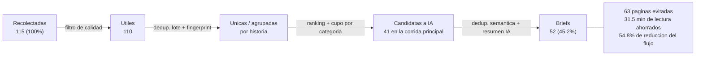

# Capítulo 4 — Impacto y Métricas

EcoBrief mide el impacto a partir del flujo real del sistema. Las métricas ambientales son estimaciones transparentes basadas en la reducción de páginas, artículos y llamadas IA — igual que en la versión anterior. A continuación se presentan los datos reales del **7 de septiembre de 2026**, el último día con una corrida completa e íntegra al momento de escribir este informe.

## 4.1 Flujo del pipeline

## 4.2 Métricas del día

| Métrica | Valor | Porcentaje |
|---|---:|---:|
| Artículos recolectados | 115 | 100 % |
| Briefs generados | 52 | 45.2 % |
| Páginas evitadas | 63 | 54.8 % |
| Minutos de lectura ahorrados | 31.5 | — |

Detalle de la corrida principal de ese día (`collection_runs #247`, 8 min 32 s de duración): 120 artículos scrapeados en bruto → 110 útiles tras el filtro de calidad → 110 rankeados → 41 seleccionados como candidatos a resumen → 22 resúmenes finales en esa corrida puntual (el resto del día se completó con corridas adicionales hasta los 52 totales). El deduplicador semántico basado en IA descartó 36 duplicados adicionales en el día — evidencia concreta de que la capa de deduplicación semántica agregada desde la versión 1 está activa y removiendo redundancia real antes de generar resúmenes.

## 4.3 Fórmulas de impacto

Se define $R$ como el total de noticias recolectadas y $B$ como los briefs generados:

**Páginas evitadas.**
$$P_{\text{evitadas}} = R - B = 115 - 52 = 63$$

**Tiempo de lectura ahorrado**, estimando 30 segundos por página evitada:
$$M_{\text{ahorrados}} = P_{\text{evitadas}} \times 0.5 = 63 \times 0.5 = 31.5 \text{ min}$$

**Tasa de reducción del flujo**, proporción de contenido descartado o consolidado respecto al total recolectado:
$$T_{\text{reducci\'on}} = 1 - \frac{B}{R} = 1 - \frac{52}{115} = 0.548 = 54.8\%$$

Esta es la misma metodología de la versión 1 — se mantiene sin cambios porque ya estaba validada, y porque cambiar la fórmula de un informe a otro haría las cifras incomparables.

## 4.4 Corroboración entre fuentes

El sistema ahora registra cuántos artículos de fuentes distintas cubrieron cada historia (`source_article_count`). En el día analizado, el promedio fue de **1.0 fuente por resumen** — es decir, ninguna historia fue corroborada por más de una de las 6 fuentes activas ese día. Esto no es necesariamente un defecto del agrupador: con solo 6 fuentes configuradas y una ventana de coincidencia estricta (similitud ≥ 0.85), es esperable que la superposición de cobertura entre medios sea baja en un día cualquiera. Vale la pena monitorear esta métrica en más días antes de sacar conclusiones sobre si el umbral de similitud es demasiado conservador.

## 4.5 Nota metodológica

Las métricas ambientales siguen siendo estimaciones operativas basadas en la reducción de páginas, artículos y llamadas IA, no una medición energética directa — la misma distinción transparente que la versión anterior. Lo que sí cambió es la fuente de los números: en la versión 1 se reportaba una única corrida de ejemplo (15 de junio de 2026); en esta versión se reportan los totales de un día completo de operación real, incluyendo todas las corridas periódicas del cron-job, no solo una ejecución manual aislada.
